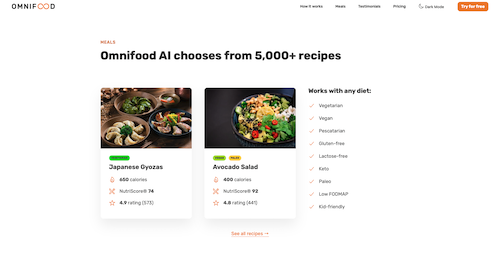

# 🍽️ Omnifood

A modern website for subscribing to a daily healthy meal delivery service powered by AI.
Instead of worrying about what to cook every day, Omnifood uses AI to select balanced meals tailored to your taste and lifestyle.

## 🚀 Demo

Here is a [🔗 Live Demo](github.com/YusufMofeed/Omnifood)

## 📷 Screenshots


<p align="left">
  
  
</p>


<p align="left">
  
  
</p>

## ✨ Features

    •	🍱 Personalized daily meal suggestions using AI.
    •	📦 Fast home delivery.
    •	📱 Fully responsive design for all devices.
    •	🌙 Light/Dark mode support.
    •	🛒 Flexible subscription plans.

⸻

## 🛠️ Built With

    •	HTML5
    •	CSS3 (Flexbox, Grid)
    •	JavaScript (ES6)

## 📂 Project Structure

```
Omnifood/
├── Readme
│   ├── README.md
│   └── screenshots
├── img
│   ├── app
│   ├── customers
│   ├── eating.jpg
│   ├── favicons
│   ├── gallery
│   ├── hero.png
│   ├── hero.webp
│   ├── logos
│   ├── meals
│   └── omnifood-logo.png
├── index.html
├── manifest.webmanifest
├── scripts
│   └── script.js
└── styles
    ├── generals.css
    ├── queries.css
    └── style.css

```

## ⚙️ Installation

1. Clone the repository:

   ```bash
   git clone https://github.com/your-username/omnifood.git
   ```

2. ⁠Open index.html in your browser.

## 👨‍💻 Author

• GitHub: [Yusuf Mofeed](https://github.com/YusufMofeed)<br/>
• LinkedIn: [Yusuf Mofeed](https://www.linkedin.com/in/yusuf-mofeed-14941a379)

## 📜 License

This project is open source and available under the [MIT License](https://opensource.org/licenses/MIT).
